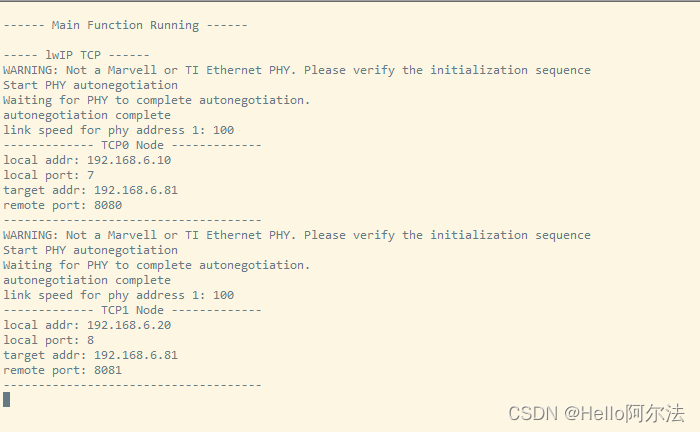
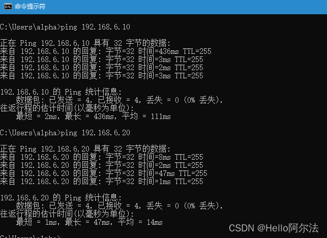
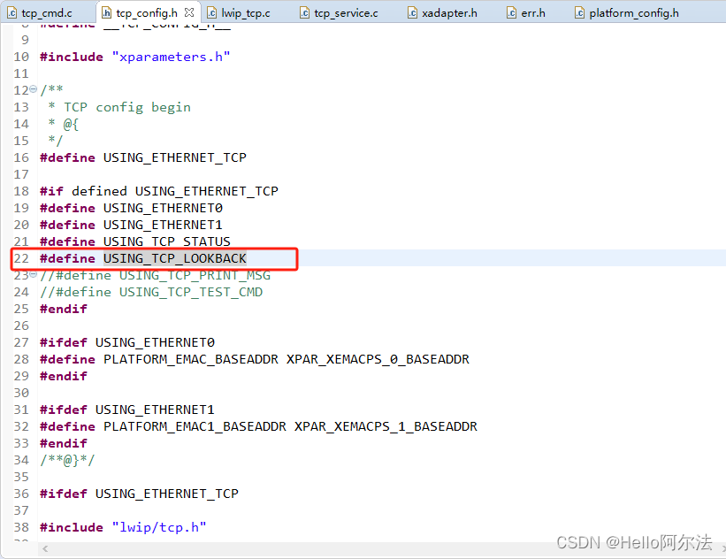
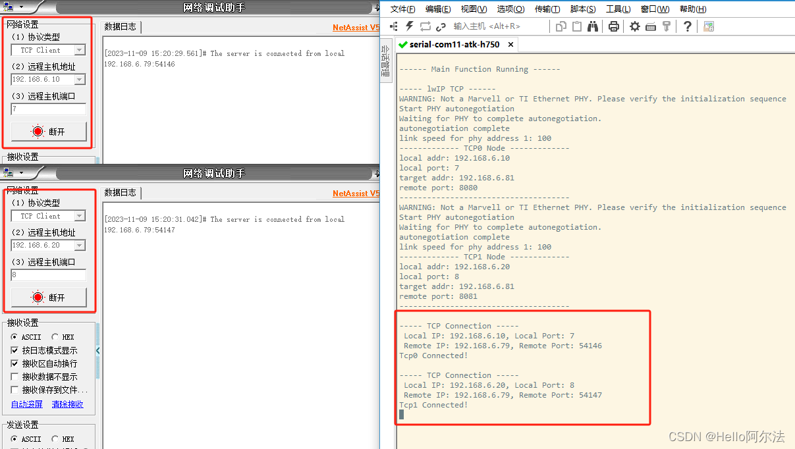
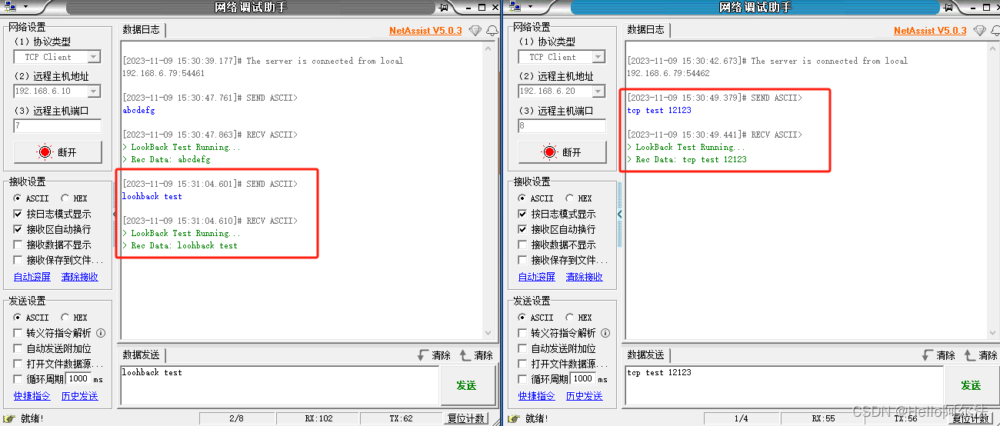

## 使用方式

添加定时器，用来调用 tcp 服务，其中，250ms 和 500ms 是必须的。

sample 代码如下：

```c
/**
 * Copyright (c) 2022-2023，HelloAlpha
 * 
 * Change Logs:
 * Date           Author       Notes
 */
#include "platform_config.h"
#include "service/timer/app_timer.h"

#define USING_ULOG
#include "ulog.h"

#define _EXPORT_FUNC(function)     \
    do                             \
    {                              \
        extern int function(void); \
        function();                \
    } while (0)

int lwip_tcp_init(void);
int app_timer_init(void);

int func_doing_always(void)
{
    static timer_flag_t *_timer_flag = &g_timer_flag;

#ifdef USING_ETHERNET_TCP
    _EXPORT_FUNC(tcp_func_always);
#endif

    if(_timer_flag->timer_flag_250ms == 1)
    {
        _timer_flag->timer_flag_250ms = 0;
#ifdef USING_ETHERNET_TCP
    _EXPORT_FUNC(tcp_func_per_250ms);
#endif
    }

    if(_timer_flag->timer_flag_500ms)
    {
        _timer_flag->timer_flag_500ms = 0;
#ifdef USING_ETHERNET_TCP
    _EXPORT_FUNC(tcp_func_per_500ms);
#endif
    }

    if(_timer_flag->timer_flag_1s == 1)
    {
        _timer_flag->timer_flag_1s = 0;
#ifdef USING_ETHERNET_TCP
        _EXPORT_FUNC(tcp_func_per_1s);
#endif
    }

    return 0;
}

int main(void)
{
    ULOG("\r\n------ Main Function Running ------\r\n");

    app_timer_init();

#ifdef USING_ETHERNET_TCP
    _EXPORT_FUNC(lwip_tcp_init);
#endif

    while(1)
    {
        func_doing_always();
    }

    return 0;
}
```

## 功能验证

- 创建网卡



- ping 指令测试



- 回环测试

tcp_config.h 中定义使用 tcp 回环测试



- 使用网络调试助手连接网络



- 进行回环测试

